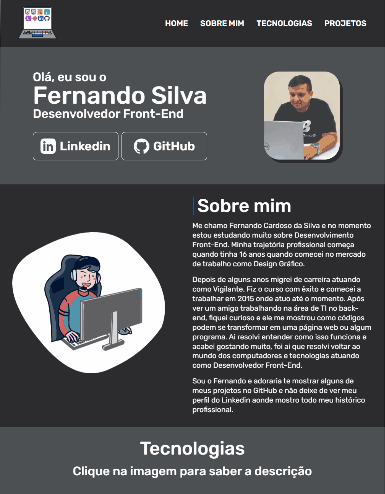
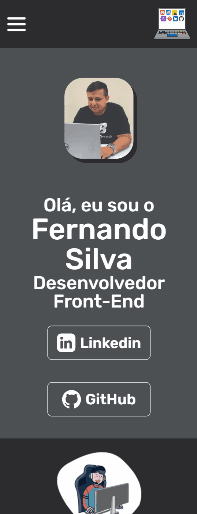

<h1>Portifólio do Fernando</h1>

Nesse projeto eu coloco meu conhecimento de desenvolvimento web que acumulei durante quase 1 ano. Projetos dos mais variados com linguagens específicas da área de front-end. Atualmente já conheço HTML5, CSS3, Bootstrap, JavaScript, TypeScript, Git e meu próximo passo é estudar React.  

Nele tive o cuidade de deixar sempre responsivo para vários tipos de telas e sempre buscando a acessibilidade, cada imagem foi feita em SVG feita por mim com o programa CorelDraw no qual domino muito bem.

O site está dividido em algumas seções. Uma delas é a seção "Sobre Mim", onde conto brevemente minha jornada até entrar no mundo da tecnologia e minha paixão por ela. A seção "Habilidades" apresenta as imagens de cada habilidade e ao clicar com mouse sobre cada imagem, uma descrição correspondente será exibida. E por fim, a seção "Projetos" exibe uma breve descrição e uma imagem de cada projeto.

Caso você queira contribuir com meu crescimento profissional ou queira sujerir melhoras no código ficarei muito grato em escutá-lo.

<h2>🖥️ Layout para desktop</h2>

<h2>📱 Layout para tablet</h2>

<h2>📱 Layout para mobile</h2>

<h2>Tecnologias utilizadas</h2>

<h2>Agradecimento</h2>

Gostaria de expressar meus sinceros agradecimentos a todas as pessoas que contribuíram para este projeto e me apoiaram ao longo do caminho, principalmente minha esposa que sempre me encorajou e me inspirou. 

E também a você, visitante deste projeto, por dedicar seu tempo para explorar e usar o que criei.

Obrigado a todos!

Ver projeto: <a href="https://portifolio-fernando-eta.vercel.app/">portifolio-fernando-eta.vercel.app/</a>
